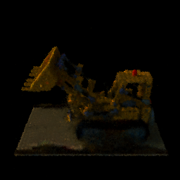
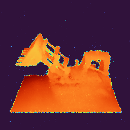
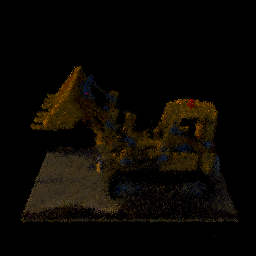
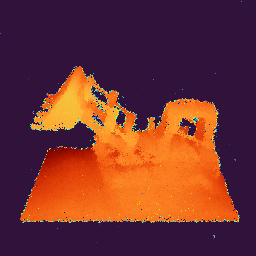
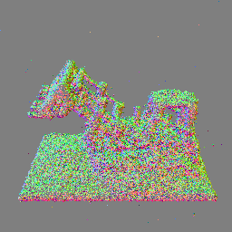

# Radiative Transfer Project Results

## Experiment Comparison: Radiance Field vs Emissive Differential Tracking (Hashgrid)

### 1. Radiance Field Hashgrid

**Experiment ID:** `radiance-field-hashgrid_experiment_20260106_164917`

**Configuration:**
- Method: `radiance-field-hashgrid`
- Integrator: Radiance Field Integrator
- Scene: `scenes/lego/scene.xml`
- Resolution: 256x256
- Training iterations: 1000
- Rays per batch: 4096
- Learning rate: 0.01

**Hash Grid Parameters:**
- Levels: 8
- Features per level: 2
- Base resolution: 16
- Hash table size: 524,288
- MLP hidden dim: 64
- MLP layers: 2
- Per-level scale: 1.5

**Results:**
| Metric | Value |
|--------|-------|
| Initial Loss | 0.011090 |
| Final Loss | 0.000991 |
| Loss Reduction | 91.1% |

**Output Artifacts:**
- RGB renders: `rgb/rgb_0000.png` - `rgb_0009.png`
- Depth maps: `depth/depth_0000.png` - `depth_0009.png`
- Normal maps: `normal/normal_0000.png` - `normal_0009.png`
- Opacity maps: `opacity/opacity_0000.png` - `opacity_0009.png`
- Ground truth: `gt_rgb/gt_rgb_0000.png` - `gt_rgb_0009.png`
- Loss curve: `loss_curve.png`

---

### 2. Emissive Differential Tracking Hashgrid

**Experiment ID:** `emissive-dt-hashgrid_experiment_20260106_165758`

**Configuration:**
- Method: `emissive-dt-hashgrid`
- Integrator: Emissive Differential Tracking
- Scene: `scenes/lego/scene.xml`
- Resolution: 256x256
- Training iterations: 1000
- Rays per batch: 4096
- Learning rate: 0.01

**Hash Grid Parameters:**
- Levels: 8
- Features per level: 2
- Base resolution: 16
- Hash table size: 524,288
- MLP hidden dim: 64
- MLP layers: 2
- Per-level scale: 1.5

**Differential Tracking Parameters:**
- Max density: 100.0
- Min step size: 0.0001
- Min throughput: 1e-06
- Max num steps: 10,000
- Majorant grid resolution: 32
- Initial majorant: 100.0

**Results:**
| Metric | Value |
|--------|-------|
| Initial Loss | 0.011099 |
| Final Loss | 0.001740 |
| Loss Reduction | 84.3% |

**Output Artifacts:**
- RGB renders: `rgb/rgb_0000.png` - `rgb_0009.png`
- Depth maps: `depth/depth_0000.png` - `depth_0009.png`
- Normal maps: `normal/normal_0000.png` - `normal_0009.png`
- Opacity maps: `opacity/opacity_0000.png` - `opacity_0009.png`
- Ground truth: `gt_rgb/gt_rgb_0000.png` - `gt_rgb_0009.png`
- Loss curve: `loss_curve.png`

---

## Summary Comparison

| Metric | Radiance Field | Emissive DT |
|--------|---------------|-------------|
| Final Loss | **0.000991** | 0.001740 |
| Initial Loss | 0.011090 | 0.011099 |
| Loss Reduction | **91.1%** | 84.3% |

**Observations:**
- Both methods started with similar initial loss (~0.011)
- Radiance Field achieved lower final loss (0.000991 vs 0.001740)
- Radiance Field showed 91.1% loss reduction compared to 84.3% for Emissive DT
- Emissive DT includes additional majorant tracking for physically-based volumetric rendering

---

## Radiant Foam as a Majorant

### Current Results

**Radiance Field Hashgrid:**

| RGB | Depth | Normal |
|-----|-------|--------|
|  |  |  |

**Emissive Differential Tracking Hashgrid:**

| RGB | Depth | Normal |
|-----|-------|--------|
|  |  |  |

### Limitations
- **Noisy**: Current results exhibit noise due to stochastic sampling in the differential tracking process

### What We Can Achieve
- **Unbiased volume rendering**: Differential tracking provides mathematically unbiased estimates
- **Physically based inverse rendering**: Proper handling of volumetric light transport
- **Reflection/Refraction**: Support for complex light interactions in participating media

### What We Need
- **Good majorant**: A tight majorant bound is critical for efficient sampling. Loose majorants lead to excessive null collisions and increased variance.

---

## Opportunities When Combining Approaches

### Limitations of Gradient Descent
- Gradient descent is prone to local minima
- Brittle for scenes with complex effects (caustics, multiple scattering, refractive geometry)

### MCMC as an Alternative
- MCMC samples the true energy function directly
- Can explore multi-modal solution spaces more effectively
- Avoids getting trapped in local minima

### Future Direction
**Can we use MCMC for more complex effects as our models get faster?**

As neural representations become more efficient to evaluate, combining MCMC sampling with differentiable rendering becomes increasingly viable:

- **Joint radiant foam / radiative transfer model**: Deploy combined approach to refractive scenes
- Leverage MCMC for global exploration while using gradient information for local refinement
- Target challenging scenarios: caustics, glass objects, subsurface scattering
